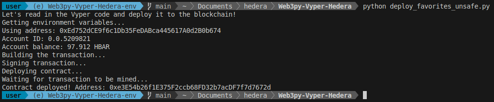

# Deploying a Vyper Smart Contract to Hedera Testnet using Python

<p align="center">
 
</p>

## Table of Contents
- [Deploying a Vyper Smart Contract to Hedera Testnet using Python](#deploying-a-vyper-smart-contract-to-hedera-testnet-using-python)
  - [Table of Contents](#table-of-contents)
  - [Prerequisites](#prerequisites)
  - [Installation](#installation)
    - [uv](#uv)
    - [pip/python](#pippython)
  - [Quickstart](#quickstart)
  - [Setup Environment](#setup-environment)
  - [Configuration](#configuration)
  - [Get Testnet HBAR](#get-testnet-hbar)
  - [The Smart Contract](#the-smart-contract)
  - [Deployment Script](#deployment-script)
  - [Key Points About Hedera Deployment](#key-points-about-hedera-deployment)
  - [Troubleshooting](#troubleshooting)
    - [Common Issues](#common-issues)
  - [Running the Deployment](#running-the-deployment)
  - [Special Thanks](#special-thanks)

This guide walks through the process of deploying a smart contract to the Hedera testnet using Python and Web3.py. We'll be deploying a simple Vyper contract that demonstrates how to interact with the Hedera network.

## Prerequisites

- [uv](https://docs.astral.sh/uv/)
  - You'll know you've done it right if you can run `uv --version` and see a version number.
- [git](https://git-scm.com/)
  - You'll know you've done it right if you can run `git --version` and see a version number.
  - Helpful shortcut:
  
```bash
# For bash
echo "source $HOME/.bashrc >> $HOME/.bash_profile"

# For zsh
echo "source $HOME/.zshenv >> $HOME/.zprofile"
```

- Python 3.x
- A text editor
- Basic understanding of smart contracts and Python
- Hedera testnet account with HBAR (will show you how to get this)

## Installation

```bash
git clone https://github.com/EdwinLiavaa/Web3py-Vyper-Hedera.git
cd Web3py-Vyper-Hedera
```

### uv 

```bash
uv sync
```

### pip/python

```bash
python -m venv ./venv
source ./venv/bin/activate
pip install -r requirements.txt
```

## Quickstart

```bash
uv run hello.py # for UV
# or
python hello.py # for pip/python
```

## Setup Environment

First, let's set up our Python environment and install the necessary packages:

```bash
# Create and activate virtual environment
python3 -m venv .venv
source .venv/bin/activate

# Install required packages
pip install python-dotenv web3 vyper
```

## Configuration

Create a `.env` file in your project root with your configuration:

```env
RPC_URL="https://testnet.hashio.io/api"
PRIVATE_KEY="your-private-key"  # Never commit your real private key!
MY_ADDRESS="your-wallet-address"
ACCOUNT_ID="your-hedera-account-id"  # Format: 0.0.xxxxx
```
THIS IS ONLY FOR TESTING - TYPICALLY YOU SHOULD NEVER SHARE YOUR PRIVATE KEY.

## Get Testnet HBAR

Before deploying, you'll need some testnet HBAR:

1. Go to the Hedera Portal: https://portal.hedera.com/
2. Create an account if you haven't already
3. Your testnet account will automatically be credited with HBAR
4. Save your Account ID and private key

## The Smart Contract

Here's our simple Vyper contract (`favorites.vy`):

```python
# @version ^0.3.7

favorite_number: public(uint256)
owner: public(address)

@external
def __init__():
    self.owner = msg.sender
    self.favorite_number = 0

@external
def store(new_number: uint256):
    self.favorite_number = new_number
```

## Deployment Script

The deployment script (`deploy_favorites_unsafe.py`) handles the deployment to Hedera's testnet. Key features:

- Uses Hedera's testnet RPC endpoint
- Handles Hedera's address format
- Manages gas fees in HBAR
- Chain ID: 296 (Hedera Testnet)

## Key Points About Hedera Deployment

1. **Network Configuration**
   - Hedera testnet uses chain ID 296
   - RPC endpoint: https://testnet.hashio.io/api

2. **Address Format**
   - Hedera uses both EVM-compatible addresses and Hedera account IDs
   - Account IDs format: 0.0.xxxxx
   - EVM addresses start with "0x"

3. **Gas Management**
   - Gas fees are paid in HBAR
   - Gas limits are typically set to 3,000,000
   - Uses maxFeePerGas and maxPriorityFeePerGas for EIP-1559 style transactions

4. **Web3.py Compatibility**
   - Uses web3.py's `raw_transaction` attribute for signed transactions
   - Ensures compatibility with latest web3.py versions
   - Properly handles transaction signing and sending

5. **Testing**
   - Always test contracts on testnet first
   - Testnet HBAR is free from the Hedera Portal
   - Monitor your deployment using Hedera's testnet explorer

## Troubleshooting

### Common Issues

1. **SignedTransaction attribute error**
   If you encounter an error like `'SignedTransaction' object has no attribute 'rawTransaction'`, make sure you're using:
   ```python
   tx_hash = w3.eth.send_raw_transaction(signed_txn.raw_transaction)  # Note: raw_transaction not rawTransaction
   ```
   This is the correct attribute name in recent web3.py versions.

2. **Insufficient HBAR**
   - Ensure you have enough testnet HBAR for deployment
   - Check your balance using the Hedera Portal
   - Request testnet HBAR if needed

3. **Network Connection Issues**
   - Verify your RPC URL is correct
   - Check your internet connection
   - Ensure the Hedera testnet is operational

## Running the Deployment

To deploy your contract:

1. Ensure your `.env` file is configured with your Hedera credentials
2. Make sure you have testnet HBAR
3. Run the deployment script:

```bash
python deploy_favorites_unsafe.py
```

The script will:
- Check your HBAR balance
- Compile the Vyper contract
- Deploy to Hedera testnet
- Provide you with the deployed contract address

## Special Thanks

The boilerplate used in this project was adopted from the Cyfrin Updraft Python and Viper Starter Kit:
- [Patrick Collins @PatrickAlphaC](https://twitter.com/PatrickAlphaC)
- [Cyfrin Updraft @cyfrinupdraft](https://updraft.cyfrin.io/courses/intermediate-python-vyper-smart-contract-development)